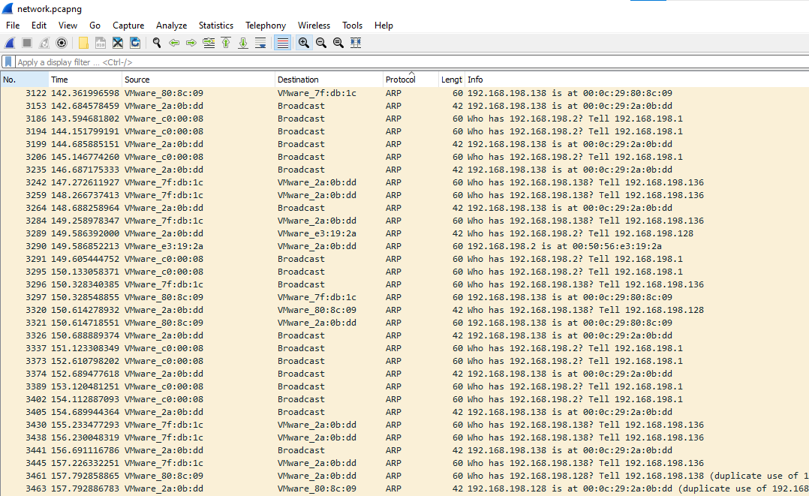
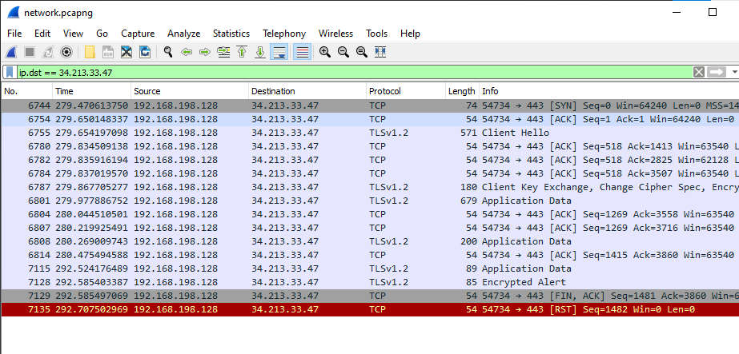

# You Can't See Me

## Parts Make A Whole

## Whaomi

* `192.168.198.128`

## Man-in-the-Middle

* `CTF{ARP}`

## Follow Me Till the End
* I think that the external party is `34.213.33.47` and the flag is somewhere in the appication data or encrypted alert - but idk how to decrypt it without the private key (I can't find the private key to decrypt it)
* 
* https://www.youtube.com/watch?v=0X2BVwNX4ks&ab_channel=SharkFestWiresharkDeveloperandUserConference