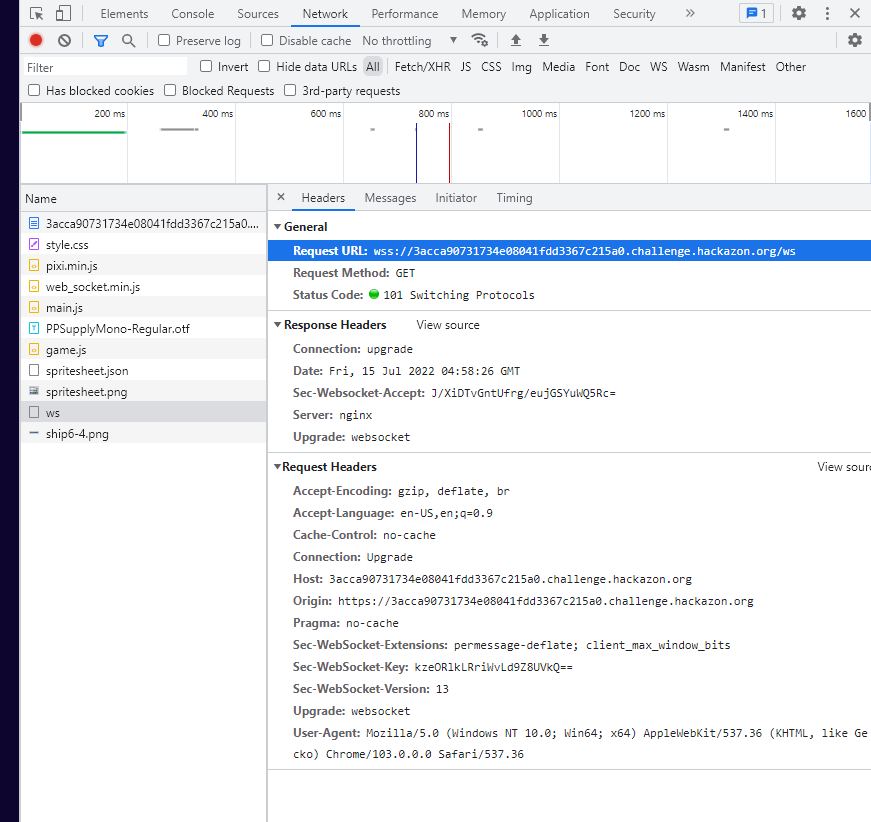
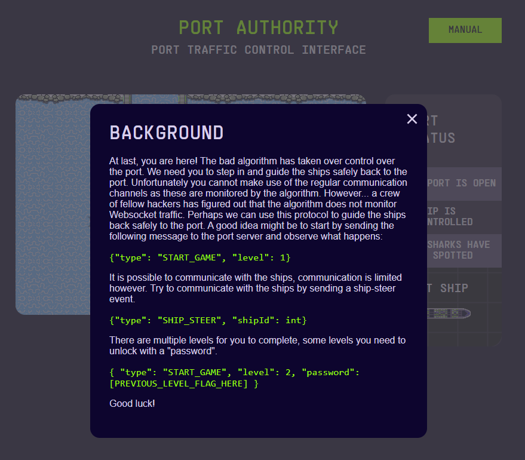
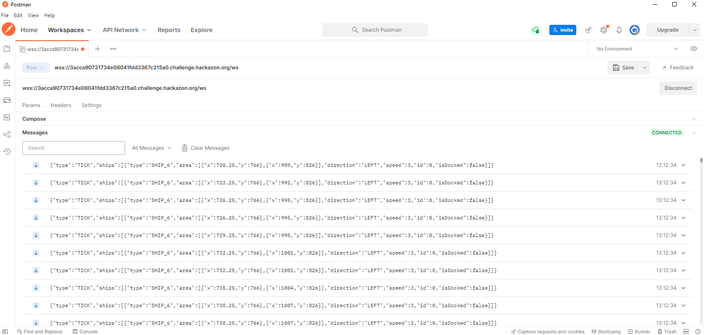
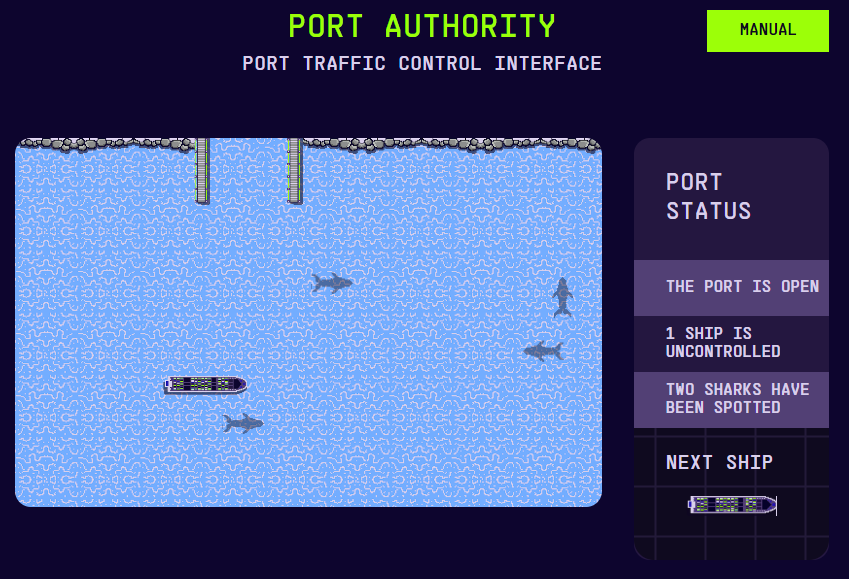
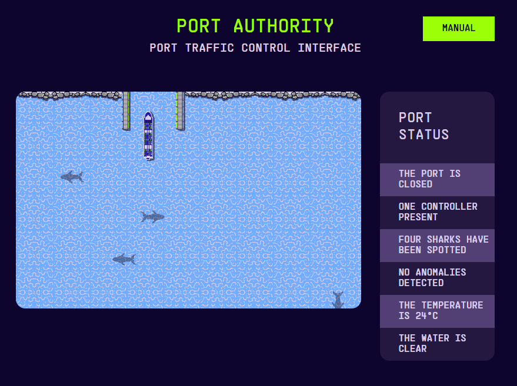
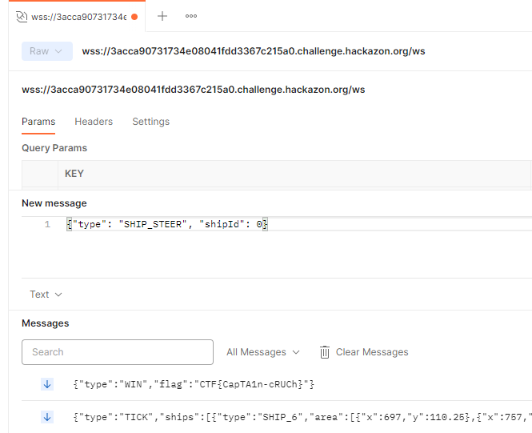
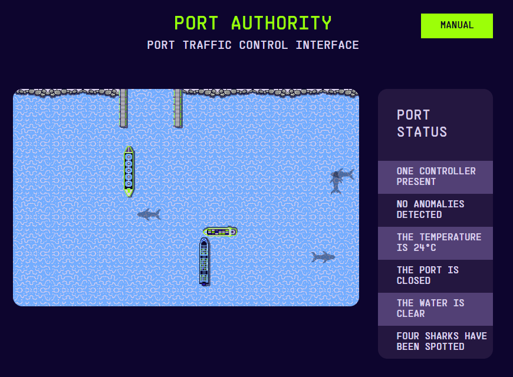

# Port Authority

## Level 1


* followed the manual


* connected and started game using postman - which produced tick data
* `{"type": "START_GAME", "level": 1}`

* and caused a ship to appear

* example tick data:
    ```json
    {
        "type": "TICK",
        "ships": [
            {
                "type": "SHIP_6",
                "area": [
                    {
                        "x": 1436,
                        "y": 790
                    },
                    {
                        "x": 1704.75,
                        "y": 850
                    }
                ],
                "direction": "RIGHT",
                "speed": 5,
                "id": 0,
                "isDocked": false
            }
        ]
    }
    ```
* used `{"type": "SHIP_STEER", "shipId": int}` to steer the ship (the shipId is `0`, based on the tick data)


* `CTF{CapTA1n-cRUCh}`

## Level 2
* `{ "type": "START_GAME", "level": 2, "password": [PREVIOUS_LEVEL_FLAG_HERE] }`
* added challenge of steering 3 ships and making sure they don't crash
* example tick data:
    ```json
    {
        "type": "TICK",
        "ships": [
            {
                "type": "SHIP_1",
                "area": [
                    {
                        "x": 605,
                        "y": 312
                    },
                    {
                        "x": 665,
                        "y": 593.9178082191781
                    }
                ],
                "direction": "UP",
                "speed": 3,
                "id": 0,
                "isDocked": false
            },
            {
                "type": "SHIP_3",
                "area": [
                    {
                        "x": 1035,
                        "y": 748
                    },
                    {
                        "x": 1224.6296296296296,
                        "y": 808
                    }
                ],
                "direction": "LEFT",
                "speed": 5,
                "id": 1,
                "isDocked": false
            },
            {
                "type": "SHIP_6",
                "area": [
                    {
                        "x": 1015,
                        "y": 811.25
                    },
                    {
                        "x": 1075,
                        "y": 1080
                    }
                ],
                "direction": "UP",
                "speed": 4,
                "id": 2,
                "isDocked": false
            }
        ]
    }
    ```
