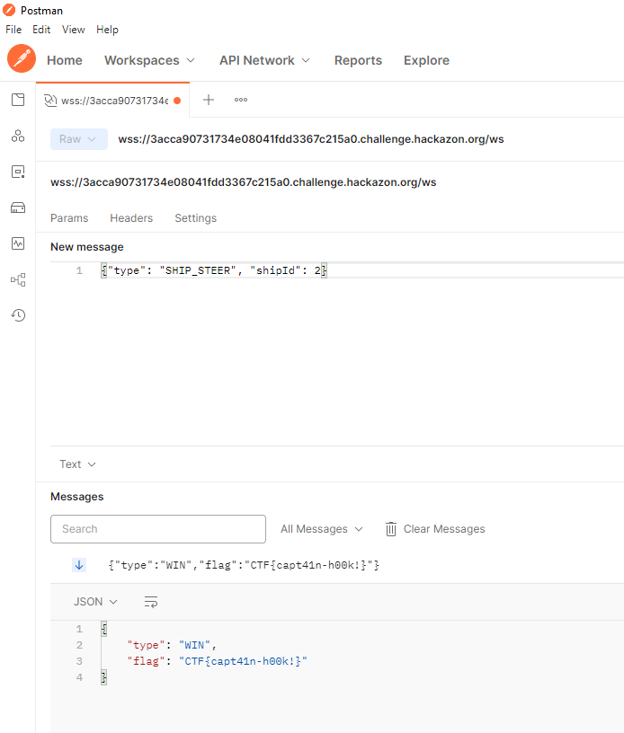

# Port Authority

## Level 1


* followed the manual


* connected and started game using postman - which produced tick data
* `{"type": "START_GAME", "level": 1}`

* and caused a ship to appear

* example tick data:
    ```json
    {
        "type": "TICK",
        "ships": [
            {
                "type": "SHIP_6",
                "area": [
                    {
                        "x": 1436,
                        "y": 790
                    },
                    {
                        "x": 1704.75,
                        "y": 850
                    }
                ],
                "direction": "RIGHT",
                "speed": 5,
                "id": 0,
                "isDocked": false
            }
        ]
    }
    ```
* used `{"type": "SHIP_STEER", "shipId": int}` to steer the ship (the shipId is `0`, based on the tick data)


* `CTF{CapTA1n-cRUCh}`

## Level 2
* `{ "type": "START_GAME", "level": 2, "password": [PREVIOUS_LEVEL_FLAG_HERE] }`
* added challenge of steering 3 ships and making sure they don't crash
* example tick data:
    ```json
    {
        "type": "TICK",
        "ships": [
            {
                "type": "SHIP_1",
                "area": [
                    {
                        "x": 605,
                        "y": 312
                    },
                    {
                        "x": 665,
                        "y": 593.9178082191781
                    }
                ],
                "direction": "UP",
                "speed": 3,
                "id": 0,
                "isDocked": false
            },
            {
                "type": "SHIP_3",
                "area": [
                    {
                        "x": 1035,
                        "y": 748
                    },
                    {
                        "x": 1224.6296296296296,
                        "y": 808
                    }
                ],
                "direction": "LEFT",
                "speed": 5,
                "id": 1,
                "isDocked": false
            },
            {
                "type": "SHIP_6",
                "area": [
                    {
                        "x": 1015,
                        "y": 811.25
                    },
                    {
                        "x": 1075,
                        "y": 1080
                    }
                ],
                "direction": "UP",
                "speed": 4,
                "id": 2,
                "isDocked": false
            }
        ]
    }
    ```

* we lose when
  * ships crash into each other
  * ships go into the port in the wrong order
* I managed to get a game with an initial state didn't result in an immediate crash and also had the first ship already heading toward the port - then I just used `{"type": "SHIP_STEER", "shipId": int}` for the second and third ships

* `CTF{capt41n-h00k!}`

## Level 3
* use `{ "type": "START_GAME", "level": 3, "password": [PREVIOUS_LEVEL_FLAG_HERE] }`
* now they added rocks
* game start data:
    ```json
    {
        "type": "GAME_START",
        "level": {
            "id": 3,
            "board": {
                "width": 1886,
                "height": 1188,
                "obstructions": [
                    {
                        "type": "HARBOUR_BORDER",
                        "area": [
                            {
                                "x": 650,
                                "y": 0
                            },
                            {
                                "x": 700,
                                "y": 215.7142857142857
                            }
                        ]
                    },
                    {
                        "type": "HARBOUR_BORDER",
                        "area": [
                            {
                                "x": 850,
                                "y": 0
                            },
                            {
                                "x": 900,
                                "y": 215.7142857142857
                            }
                        ]
                    },
                    {
                        "type": "BORDER_ROCK",
                        "area": [
                            {
                                "x": 0,
                                "y": 0
                            },
                            {
                                "x": 650,
                                "y": 51
                            }
                        ]
                    },
                    {
                        "type": "BORDER_ROCK",
                        "area": [
                            {
                                "x": 900,
                                "y": 0
                            },
                            {
                                "x": 1886,
                                "y": 51
                            }
                        ]
                    },
                    {
                        "type": "ROCKS_SMALL_1",
                        "area": [
                            {
                                "x": 950,
                                "y": 875
                            },
                            {
                                "x": 1040,
                                "y": 971.66
                            }
                        ]
                    },
                    {
                        "type": "ROCKS_SMALL_3",
                        "area": [
                            {
                                "x": 200,
                                "y": 600
                            },
                            {
                                "x": 290,
                                "y": 670.02
                            }
                        ]
                    },
                    {
                        "type": "ROCKS_SMALL_2",
                        "area": [
                            {
                                "x": 650,
                                "y": 300
                            },
                            {
                                "x": 710,
                                "y": 339.96
                            }
                        ]
                    },
                    {
                        "type": "ROCKS_SMALL_1",
                        "area": [
                            {
                                "x": 850,
                                "y": 350
                            },
                            {
                                "x": 920,
                                "y": 425.18
                            }
                        ]
                    },
                    {
                        "type": "ROCKS_SMALL_3",
                        "area": [
                            {
                                "x": 1600,
                                "y": 500
                            },
                            {
                                "x": 1670,
                                "y": 554.46
                            }
                        ]
                    }
                ],
                "harbour": [
                    {
                        "x": 627,
                        "y": 0
                    },
                    {
                        "x": 825,
                        "y": 107.85714285714285
                    }
                ]
            },
            "mechanics": {
                "borderCollision": false,
                "sequentialDocking": true
            },
            "ships": [
                null,
                null,
                null
            ]
        }
    }
    ```
* example tick data:
    ```json
    {
        "type": "TICK",
        "ships": [
            {
                "type": "SHIP_5",
                "area": [
                    {
                        "x": 1364,
                        "y": 51
                    },
                    {
                        "x": 1424,
                        "y": 321.63829787234044
                    }
                ],
                "direction": "UP",
                "speed": 5,
                "id": 0,
                "isDocked": false
            },
            {
                "type": "SHIP_2",
                "area": [
                    {
                        "x": 475,
                        "y": 811
                    },
                    {
                        "x": 713.8436830835118,
                        "y": 871
                    }
                ],
                "direction": "RIGHT",
                "speed": 5,
                "id": 1,
                "isDocked": false
            },
            {
                "type": "SHIP_4",
                "area": [
                    {
                        "x": 724,
                        "y": 281
                    },
                    {
                        "x": 1004,
                        "y": 341
                    }
                ],
                "direction": "LEFT",
                "speed": 6,
                "id": 2,
                "isDocked": false
            }
        ]
    }
    ```