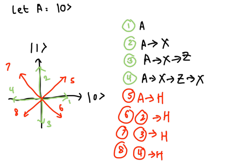

# Quantum state

## First flag
* 
* Solution: 8 

## Second, Third, Fourth Flags
* Conduct matrix multiplications according to the gates
* Second flag solution: [-1,0]
* Third flag solution: [2,1,0,0,1]
* Fourth flag solution: [AW,BZ,CX,DY]
