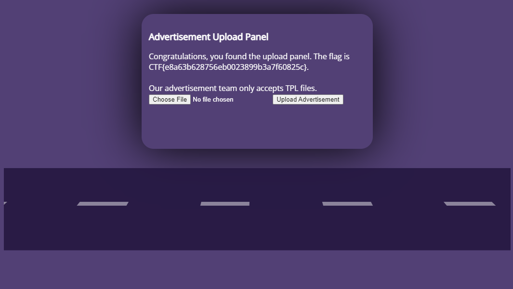
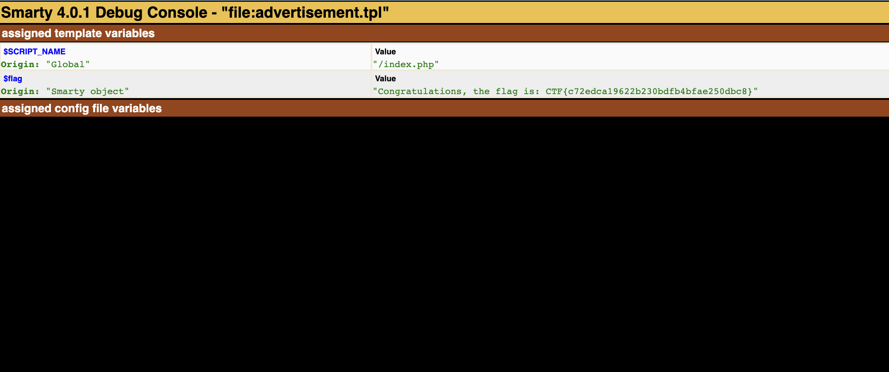

# BIllboard Mahem
## Find the Uplaod Form
* The URL provided brings us to htis page:
  * 
* Hovering over the billboard reveals the first flag:
  * 
* `CTF{e8a63b628756eb0023899b3a7f60825c}`

## Getting the flag
This page is created using php and the templating language is `Smarty`. The flag is stored as a template variable. Variables passed into Smarty can be accessed by `{debug}`.

Therefore, the file you need to submit looks like this
```html
<div>{debug}</div>
```

A debug console will open in a new tab (you might have to check your browser settings to allow for pop-ups). The debug console looks like this:


From here, you can see that the flag is `CTF{c72edca19622b230bdfb4bfae250dbc8}`