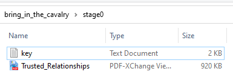
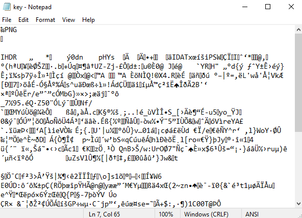
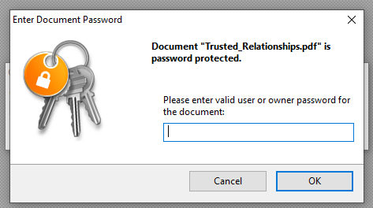
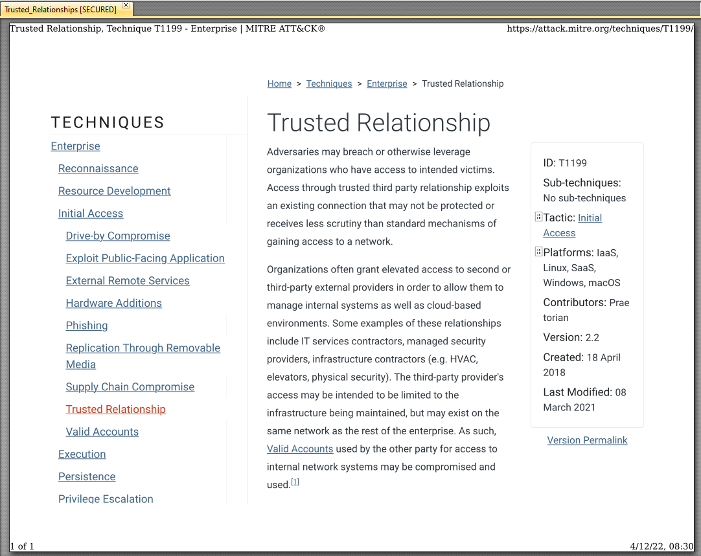
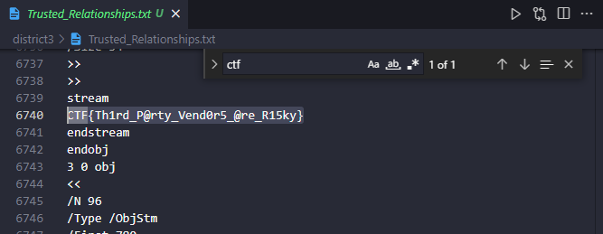

# Bring in the Cavalry

## Where it All Started
* The given `.zip` file contains 2 files (within a `stage_0` folder):
  * 
* Opening the `key.txt` file gives us:
  * 
* Since the top of the file says `PNG`, I changed the file extension to `.png` and openning it as a png gives us the key - `N0_Brutef0rce`:
  * 
* The other file provided (`Trusted_Relationships.png`) is an encrypted pdf which requires a password to be accessed:
  * 
* Entering the key from before (`N0_Brutef0rce`) gives us access to the pdf
  * 
* I tried looking reading the document, clicking on some of the links and checking the documents metadata, all to no avail
* Finally found it after converting the `.pdf` into a `.txt` and *Ctrl+F*ing the document:
  * 
* `CTF{Th1rd_P@rty_Vend0r5_@re_R15ky}`

