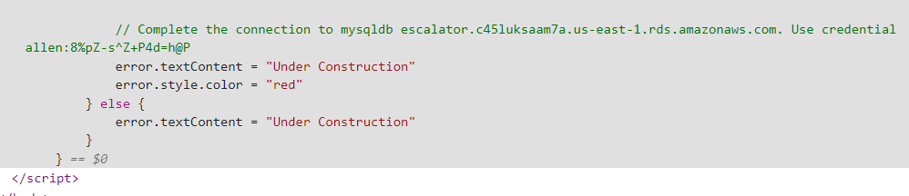

Routes that we have access to:
```
/forgotpassword
/index.html
/login
/logout
/profile (requires login)
```
At `/forgotpassword` you could see this:

near the bottom of `Inspect` (credentials might be different for each user)

(I think this is where we should look at since the challenge name is cloud ESCALATOR)