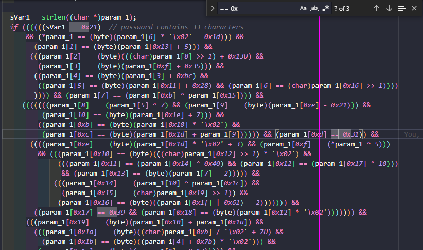

# Crack The Password

-   essentially following this: https://swanandx.github.io/blog/posts/re/ctfs/
-   ran `$ strings CrackThePassword`

```
/lib64/ld-linux-x86-64.so.2
mgUa
puts
stdin
printf
fgets
strlen
__cxa_finalize
__libc_start_main
libc.so.6
GLIBC_2.2.5
_ITM_deregisterTMCloneTable
__gmon_start__
_ITM_registerTMCloneTable
u+UH
[]A\A]A^A_
Please enter the password:
Access granted!
Access denied!
;*3$"
GCC: (Debian 11.3.0-1) 11.3.0
Scrt1.o
__abi_tag
crtstuff.c
deregister_tm_clones
__do_global_dtors_aux
completed.0
__do_global_dtors_aux_fini_array_entry
frame_dummy
__frame_dummy_init_array_entry
CrackThePassword.c
__FRAME_END__
__init_array_end
_DYNAMIC
__init_array_start
__GNU_EH_FRAME_HDR
_GLOBAL_OFFSET_TABLE_
__libc_csu_fini
_ITM_deregisterTMCloneTable
puts@GLIBC_2.2.5
stdin@GLIBC_2.2.5
_edata
strlen@GLIBC_2.2.5
printf@GLIBC_2.2.5
__libc_start_main@GLIBC_2.2.5
fgets@GLIBC_2.2.5
__data_start
__gmon_start__
__dso_handle
_IO_stdin_used
validatePassword
__libc_csu_init
__bss_start
main
__TMC_END__
_ITM_registerTMCloneTable
__cxa_finalize@GLIBC_2.2.5
.symtab
.strtab
.shstrtab
.interp
.note.gnu.property
.note.gnu.build-id
.note.ABI-tag
.gnu.hash
.dynsym
.dynstr
.gnu.version
.gnu.version_r
.rela.dyn
.rela.plt
.init
.plt.got
.text
.fini
.rodata
.eh_frame_hdr
.eh_frame
.init_array
.fini_array
.dynamic
.got.plt
.data
.bss
.comment
```

-   we run `gdb -q CrackThePassword`
-   which produces

```
$ gdb -q CrackThePassword
Reading symbols from CrackThePassword...
(No debugging symbols found in CrackThePassword)
```

-   then we set the dissasembly flavour using `set disassembly-flavor intel`

```
(gdb) set disassembly-flavor intel
```

-   and look at the functions using `info functions`

```shell
(gdb) info functions
All defined functions:

Non-debugging symbols:
0x0000000000001000  _init
0x0000000000001030  puts@plt
0x0000000000001040  strlen@plt
0x0000000000001050  printf@plt
0x0000000000001060  fgets@plt
0x0000000000001070  __cxa_finalize@plt
0x0000000000001080  _start
0x00000000000010b0  deregister_tm_clones
0x00000000000010e0  register_tm_clones
0x0000000000001120  __do_global_dtors_aux
0x0000000000001160  frame_dummy
0x0000000000001169  validatePassword
0x0000000000001607  main
0x0000000000001680  __libc_csu_init
0x00000000000016e0  __libc_csu_fini
0x00000000000016e4  _fini
```

-   When you run the program, it asks for a password as input.
-   I first used `gdb` and created breakpoints to try to skip to where the flag would be outputted but that didn't work
-   Then I used [Ghidra]() to analyse the program's source code (Ghidra disassembles the programs and also lets you view them in C, which is much more human readable than assembly) and realised that the flag isn't being printed out, the flag is the input itself.

```c

undefined8 validatePassword(byte *param_1)

{
  size_t sVar1;
  undefined8 uVar2;

  sVar1 = strlen((char *)param_1);
  if ((((((sVar1 == 0x21)  // password contains 33 characters
      && (*param_1 == (byte)(param_1[6] * '\x02' - 0x1d))) &&
        (param_1[1] == (byte)(param_1[0x13] + 5))) &&
       (((param_1[2] == (byte)(((char)param_1[8] >> 1) + 0x13U) &&
         (param_1[3] == (byte)(param_1[0xf] + 0x35))) &&
        ((param_1[4] == (byte)(param_1[3] + 0xbc) &&
         ((param_1[5] == (byte)(param_1[0x11] + 0x28) && (param_1[6] == (char)param_1[0x16] >> 1))))
        )))) && (param_1[7] == (param_1[0xb] ^ param_1[0x15]))) &&
     (((((((param_1[8] == (param_1[5] ^ 7) && (param_1[9] == (byte)(param_1[0xe] - 0x21))) &&
          (param_1[10] == (byte)(param_1[0x1e] + 7))) &&
         ((param_1[0xb] == (byte)(param_1[0x10] * '\x02') &&
          (param_1[0xc] == (byte)(param_1[0x1d] + param_1[9]))))) && (param_1[0xd] == 0x31)) &&
       ((((param_1[0xe] == (byte)(param_1[0x1d] * '\x02' + 3) && (param_1[0xf] == (*param_1 ^ 5)))
         && (((param_1[0x10] == (byte)(((char)param_1[0x12] >> 1) * '\x02') &&
              (((param_1[0x11] == (param_1[0x14] ^ 0x40) && (param_1[0x12] == (param_1[0x17] ^ 10)))
               && (param_1[0x13] == (byte)(param_1[7] - 2))))) &&
             (((param_1[0x14] == (param_1[10] ^ param_1[0x1c]) &&
               (param_1[0x15] == (char)param_1[0x19] >> 1)) &&
              (param_1[0x16] == (byte)((param_1[0x1f] | 0x61) - 2))))))) &&
        ((param_1[0x17] == 0x39 && (param_1[0x18] == (byte)(param_1[0x12] * '\x02'))))))) &&
      (((param_1[0x19] == (byte)(param_1[0x10] + param_1[0x1a]) &&
        (((param_1[0x1a] == (byte)((char)param_1[0xb] / '\x02' + 7U) &&
          (param_1[0x1b] == (byte)((param_1[4] + 0x7b) * '\x02'))) &&
         (param_1[0x1c] == (byte)(param_1[1] - 0x13))))) &&
       (((param_1[0x1d] == (byte)(param_1[0x20] + 0xb3) &&
         (param_1[0x1e] == (byte)(param_1[0x1f] - param_1[0x10]))) &&
        ((param_1[0x1f] == (byte)(param_1[0xd] * '\x02' + 1) &&
         (param_1[0x20] == (byte)(param_1[4] + param_1[0xf]))))))))))) {
    uVar2 = 1;
  }
  else {
    uVar2 = 0;
  }
  return uVar2;
}
```
* 
