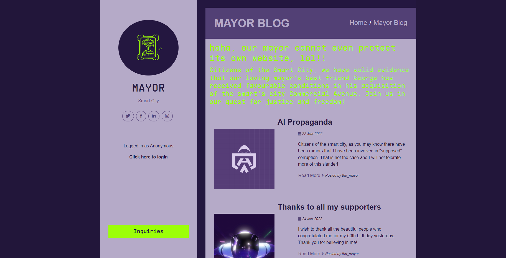
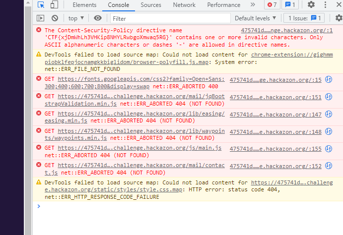
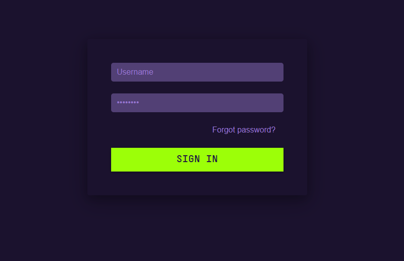
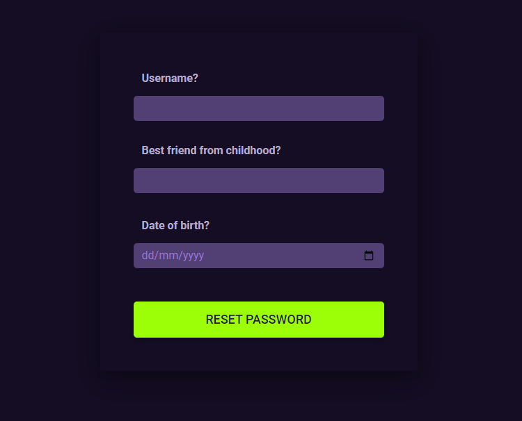
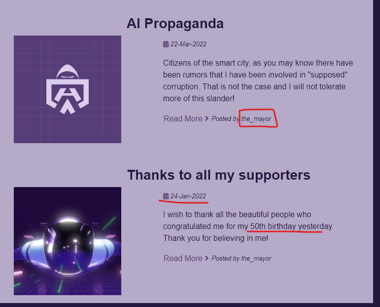
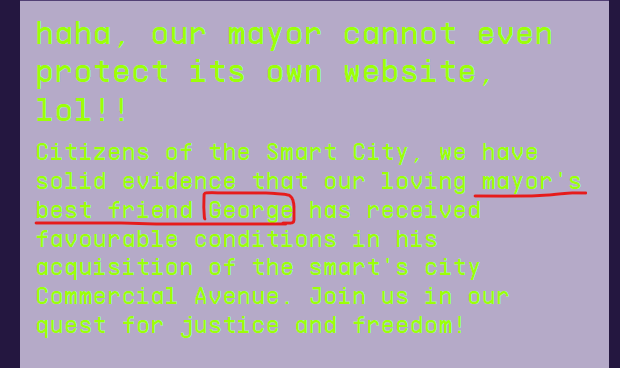
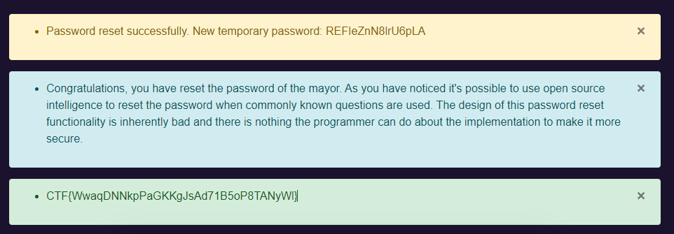
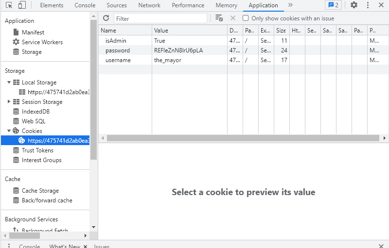
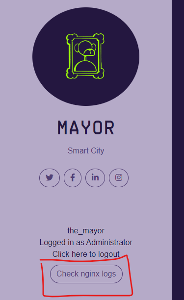
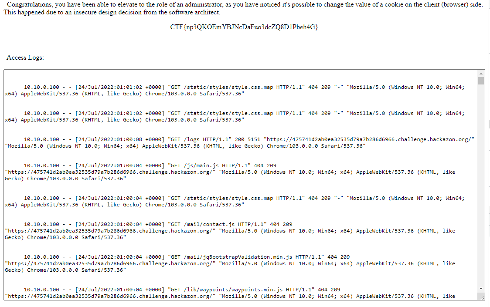

# Mayor's Blog



## Find Hidden Flag
* Openning the console, we can see that the first error message contains a flag
  * 
  * `CTF{xjDmWhLh3VHKip8NHYLRwbgoXmwaq5RG}`

* When we click on the login page:
  * 

## Get Access to an Editor Account
* When we click on `Forgot password`, we are prompted to enter 3 peices of information: the username, best friend from childhood and date of birth
  * 
* Using open source intelligence, we can obtain all of this information from the website itself.
* From the blog posts, we can see that the mayor's username is `the_mayor` and their birthday is on the `23rd Jan 1972` and his best friend is `George`
  * 
  * 
* Enterring the 3 pieces of information gives us a temporary password as well as the flag:
  * 
* `CTF{WwaqDNNkpPaGKKgJsAd71B5oP8TANyWl}`
* temporary password: `REFIeZnN8lrU6pLA`

## Escalate to Administrative Priviledges
* Check the cookies and change `isAdmin` to `True` then reload
* 
* this results in a new button on the page: `Check nginx logs`
* 
* which, upon clicking it, gives us the flag
  * 
* `CTF{np3QKOEmYBJNcDaFuo3dcZQ8D1Pbeh4G}`

## Gain Access to the Developer Console
Looking through the access logs, we can see that someone has accessed endpoint `/console` before:


However, going to the `/console` endpoint gives a `404 Not Found` response. I tried looking at some common endpoints that might provide clues and at `robots.txt` gives us this response:
```
User-Agent: *
Disallow: /admin_shell
```

Trying the `/admin_shell` endpoint brings us to a page that tells us only system admins have access to that page. So onto finding information about system admins.

Going back to the logs, one of the requests catches my eye:


Well that's the system admin login. After logging in using this credentials, going back to `/admin_shell` shows our next flag and a console for us to interact with.

## Crack the Password of the Admin Account on the Server
